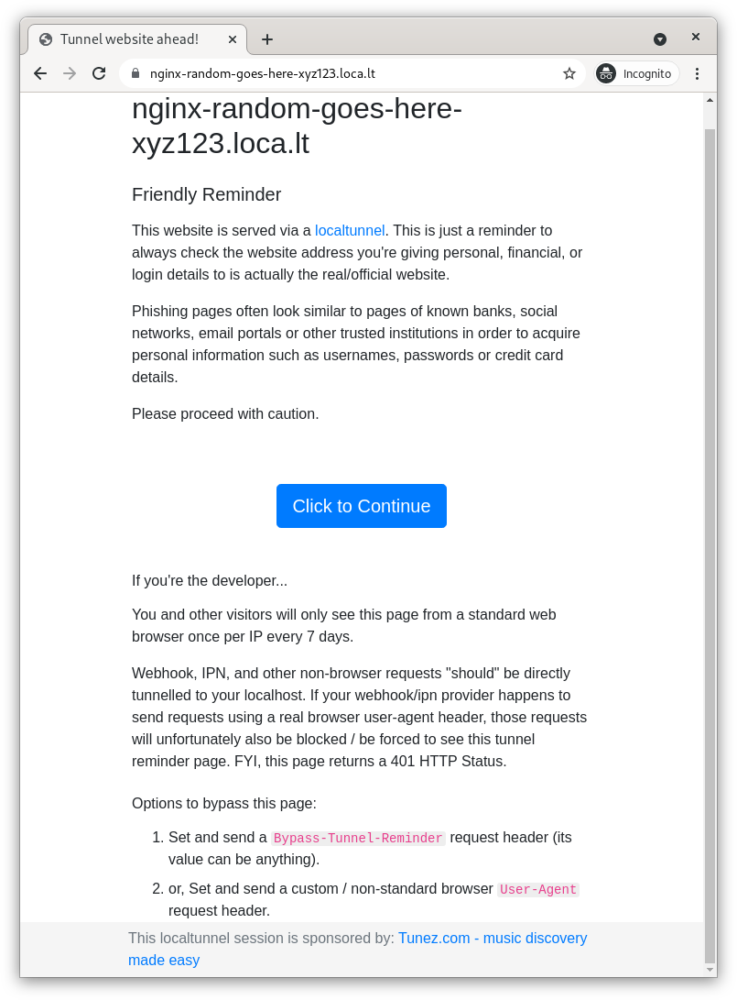

# k8s-tunnel-controller

This project is an **MVP** demonstrating how easy is to expose an internal Kubernetes services to the worlwide
with automatic TLS without cert-manager, DNS or opening ports in your home network/router.

## Based on go-http-tunnel

This project uses the [go-http-tunnel](https://github.com/mmatczuk/go-http-tunnel) by [`mmatczuk`](https://github.com/mmatczuk) upstream projec.

## MVP: run it locally

### Requirements

Basic requirements these days:

- kind - kubectl *(of course)*
- access to dockerhub (tunnel container image currently there)
- python 3.9 - virtualenv
- git
- openssl

### Let's go

#### Create the (local) cluster

```bash
$ kind create cluster --name tunnels
Creating cluster "tunnels" ...
 ✓ Ensuring node image (kindest/node:v1.21.1) 🖼
 ✓ Preparing nodes 📦
 ✓ Writing configuration 📜
 ✓ Starting control-plane 🕹️
 ✓ Installing CNI 🔌
 ✓ Installing StorageClass 💾
Set kubectl context to "kind-tunnels"
You can now use your cluster with:

kubectl cluster-info --context kind-tunnels

Have a nice day! 👋
$ kind get kubeconfig --name tunnels > kubeconfig
$ export KUBECONFIG=$(pwd)/kubeconfig
$ kubectl get nodes
NAME                    STATUS   ROLES                  AGE     VERSION
tunnels-control-plane   Ready    control-plane,master   3m38s   v1.21.1
```

#### Run the project

##### Pre-requisites

This is a **MVP**, so we need to install some pre-requisites.
This certificates must be generated per namespace and must be the controller the one in charge of creating it.

```bash
$ openssl req -x509 -nodes -newkey rsa:2048 -sha256 -keyout client.key -out client.crt
$ kubectl create secret tls k8s-tunnel-controller-certs --cert client.crt --key client.key
secret/k8s-tunnel-controller-certs created
```

##### Run the project

```bash
$ git clone git@github.com:angelbarrera92/k8s-tunnel-controller.git
$ cd k8s-tunnel-controller
$ virtualenv -p python3 venv
$ source venv/bin/activate
$ pip install -r requirements.txt
...
..
.
Successfully installed aiohttp-3.8.1 aiosignal-1.2.0 async-timeout-4.0.1 attrs-21.2.0 certifi-2021.10.8 charset-normalizer-2.0.8 click-8.0.3 frozenlist-1.2.0 idna-3.3 iso8601-1.0.2 kopf-1.35.3 multidict-5.2.0 pykube-ng-21.10.0 python-json-logger-2.0.2 pyyaml-6.0 requests-2.26.0 typing-extensions-4.0.0 urllib3-1.26.7 yarl-1.7.2
$ kopf run controller.py
[2021-11-28 13:37:04,078] kopf._core.engines.a [INFO    ] Initial authentication has been initiated.
[2021-11-28 13:37:04,088] kopf.activities.auth [INFO    ] Activity 'login_via_pykube' succeeded.
[2021-11-28 13:37:04,088] kopf._core.engines.a [INFO    ] Initial authentication has finished.
```

#### Execute the examples

**Open a new terminal** *(to don't stop the controller)* configure the `KUBECONFIG` env variable then:

```bash
$ export KUBECONFIG=$(pwd)/kubeconfig
$ kubectl get nodes
NAME                    STATUS   ROLES                  AGE     VERSION
tunnels-control-plane   Ready    control-plane,master   3m38s   v1.21.1
$ kubectl apply -f hack/deployments/example/nginx.yaml
pod/nginx created
service/nginx created
```

Then, a new **pod** have to be created:

```bash
$ kubectl get pods
NAME                            READY   STATUS              RESTARTS   AGE
nginx                           1/1     Running             0          37s
nginx-random-goes-here-xyz123   0/1     ContainerCreating   0          37s
```

The `nginx-random-goes-here-xyz123` pod has been created by the controller. Why? Because the service contains a magic annotation: `k8s-tunnel-controller/tunnel: nginx-random-goes-here-xyz123`

```bash
$ kubectl get svc nginx -o yaml
apiVersion: v1
kind: Service
metadata:
  annotations:
    k8s-tunnel-controller/tunnel: nginx-random-goes-here-xyz123
<REDACTED>
```

Checking the logs of the pods created:

```bash
$ kubectl logs -f nginx-random-goes-here-xyz123
your url is: https://nginx-random-goes-here-xyz123.loca.lt
```

You'll see the right URL. It contains the subdomain specified in the annotation: `nginx-random-goes-here-xyz123`.

Finally, visiting it:



Then click on continue


## Next steps

There are a lot of `TODO`s in code. Then a lot of ideas, this is just an MVP. Thanks!

