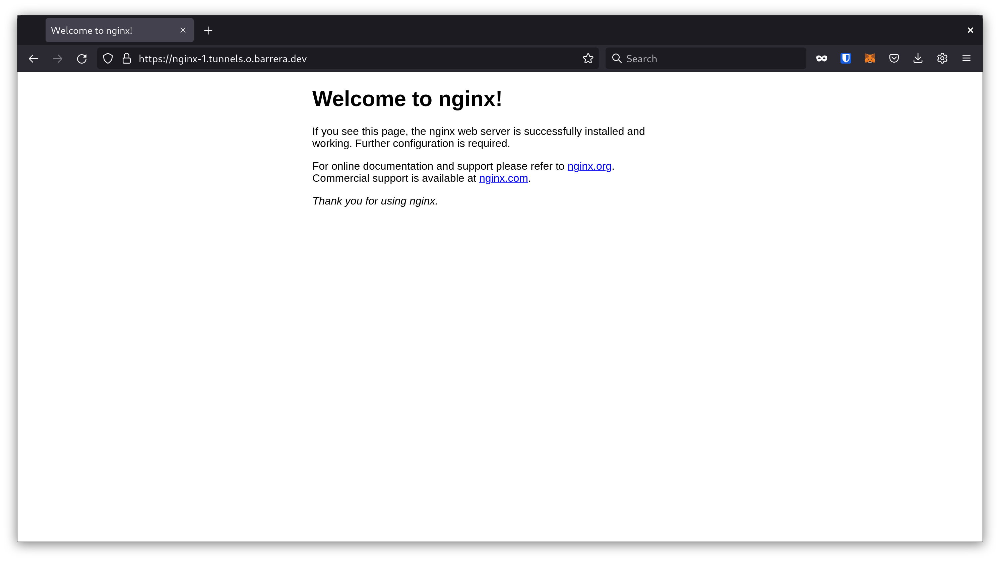

# Kubernetes Tunnel Controller

**ATTENTION:** This project is currently in active developing phase.
It was born to demonstrate how easy could it be to expose an internal Kubernetes services to the worlwide
with automatic TLS without cert-manager, DNS or opening ports in your home network/router.

## Based on go-http-tunnel

This project uses the [go-http-tunnel](https://github.com/mmatczuk/go-http-tunnel) by [`mmatczuk`](https://github.com/mmatczuk) upstream projec.
The server-side component is running in a cloud instance.

Ideally, this kubernetes controller will hide the technical details of the tunneling and expose a simple API to expose services.

## Run it locally (from outside the cluster)

### Requirements

- `kind` and `kubectl`
- access to GitHub *(tunnel container image currently there)*
- `python 3.9` - `virtualenv`
- `git`

### Create the (local) cluster

*Avoid this step if you already have a running cluster.*

```bash
$ kind create cluster --name tunnels
Creating cluster "tunnels" ...
 ✓ Ensuring node image (kindest/node:v1.21.1) 🖼
 ✓ Preparing nodes 📦
 ✓ Writing configuration 📜
 ✓ Starting control-plane 🕹️
 ✓ Installing CNI 🔌
 ✓ Installing StorageClass 💾
Set kubectl context to "kind-tunnels"
You can now use your cluster with:

kubectl cluster-info --context kind-tunnels

Have a nice day! 👋
$ kind get kubeconfig --name tunnels > kubeconfig
$ export KUBECONFIG=$(pwd)/kubeconfig
$ kubectl get nodes
NAME                    STATUS   ROLES                  AGE     VERSION
tunnels-control-plane   Ready    control-plane,master   3m38s   v1.21.1
```

### Run the project

```bash
$ git clone git@github.com:angelbarrera92/k8s-tunnel-controller.git
$ cd k8s-tunnel-controller
$ virtualenv -p python3 venv
$ source venv/bin/activate
$ pip install -r requirements.txt
...
..
.
Successfully installed aiohttp-3.8.1 aiosignal-1.2.0 async-timeout-4.0.1 attrs-21.2.0 certifi-2021.10.8 charset-normalizer-2.0.8 click-8.0.3 frozenlist-1.2.0 idna-3.3 iso8601-1.0.2 kopf-1.35.3 multidict-5.2.0 pykube-ng-21.10.0 python-json-logger-2.0.2 pyyaml-6.0 requests-2.26.0 typing-extensions-4.0.0 urllib3-1.26.7 yarl-1.7.2
$ kopf run -A --liveness=http://0.0.0.0:8080/healthz controller.py
[2021-11-28 13:37:04,078] kopf._core.engines.a [INFO    ] Initial authentication has been initiated.
[2021-11-28 13:37:04,088] kopf.activities.auth [INFO    ] Activity 'login_via_pykube' succeeded.
[2021-11-28 13:37:04,088] kopf._core.engines.a [INFO    ] Initial authentication has finished.
```

### Execute the examples

**Open a new terminal** *(avoid to stop the controller)* configure the `KUBECONFIG` env variable then:

```bash
$ export KUBECONFIG=$(pwd)/kubeconfig
$ kubectl get nodes
NAME                    STATUS   ROLES                  AGE     VERSION
tunnels-control-plane   Ready    control-plane,master   3m38s   v1.21.1
$ kubectl apply -f hack/deployments/example/nginx.yaml
pod/nginx created
service/nginx created
```

Then, a new **pod,configmap and secret** will pop up in the cluster:

```bash
$ kubectl get pods
NAME                    READY   STATUS              RESTARTS   AGE
nginx                   0/1     ContainerCreating   0          6s
nginx-80-tunnel-afmmo   0/1     ContainerCreating   0          6s
```

The `nginx-80-tunnel-afmmo` pod has been created by the controller. Why? Because the service contains a magic annotation: `k8s-tunnel-controller/tunnel: nginx-1`

```bash
$ kubectl get svc nginx -o yaml
apiVersion: v1
kind: Service
metadata:
  annotations:
    k8s-tunnel-controller/tunnel: nginx-1
<REDACTED>
```

Checking the logs of the pods created:

```bash
$ kubectl logs -f nginx-80-tunnel-afmmo
2021/12/26 06:19:16 config server_addr: tunnels.o.barrera.dev:5223
tls_crt: /certs/client.crt
tls_key: /certs/client.key
root_ca: ""
backoff:
  interval: 500ms
  multiplier: 1.5
  max_interval: 1m0s
  max_time: 15m0s
tunnels:
  nginx:
    proto: http
    addr: http://nginx:80
    host: nginx-1.tunnels.o.barrera.dev

2021/12/26 06:19:16 level 1 action start
2021/12/26 06:19:16 level 1 action dial network tcp addr tunnels.o.barrera.dev:5223
2021/12/26 06:19:16 level 1 action handshake addr 129.159.204.185:5223
```

You'll see the right URL. It contains the subdomain specified in the annotation: `nginx-1.tunnels.o.barrera.dev`.

Finally, visiting it:



### Important notes

The project uses a `barrera.dev` subdomain tu expose your services. Take in mind the following assumptions:

- Your chossen subdomain must be unique.
  - Using the value `my-service` in the `k8s-tunnel-controller/tunne` annotation will result in a FQDN `my-service.tunnels.o.barrera.dev`.
  - It could be a good idea to add your username to the subdomain: `my-service-<username>`, then `my-service-<username>.tunnels.o.barrera.dev`.
- There's no automatic way to use a different domain.
  - If you want to use your own domain or a different `tunnels.o.barrera.dev` subdomain `(dedicated tenant)`, contact me.

## Deploy using Helm

This project uses [`helm`](https://helm.sh/) chart to deploy the controller.

```bash
$ helm upgrade --install tunnels deployments/kubernetes/helm/k8s-tunnel-controller/
Release "tunnels" does not exist. Installing it now.
NAME: tunnels
LAST DEPLOYED: Sun Dec 26 07:23:42 2021
NAMESPACE: default
STATUS: deployed
REVISION: 1
NOTES:
1. Get the application URL by running these commands:
  export POD_NAME=$(kubectl get pods --namespace default -l "app.kubernetes.io/name=k8s-tunnel-controller,app.kubernetes.io/instance=tunnels" -o jsonpath="{.items[0].metadata.name}")
  export CONTAINER_PORT=$(kubectl get pod --namespace default $POD_NAME -o jsonpath="{.spec.containers[0].ports[0].containerPort}")
  echo "Visit http://127.0.0.1:8080 to use your application"
  kubectl --namespace default port-forward $POD_NAME 8080:$CONTAINER_PORT
```


## Next steps

- There are a lot of `TODO`s in code.
- Publish server-side code and documentation.
- Automate helm chart documentation (frigate) and add it to the linter phase.
  - Publish the helm chart in ArtifcatHub.
- Run as no root
- Enable use different subdomain.
  - With docs
- Change the log levels in all log invocation.
- Add a `--liveness` and `--readiness` endpoint to the tunnel pod.
  - Add these endpoint as tunnel pod probes.
  - Also, add resource limits and requests.

Then a lot of ideas. Thanks!
